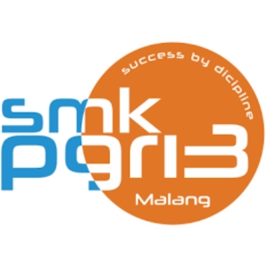

<!--<p align="center">
  
</p>-->

<p align="center">
  <a href="#" target="_blank">
    
  </a>
</p>

<p align="center">
  <a href="https://laravel.com/"></a>
  <a href="https://www.php.net/"></a>
  <a href="https://tailwindcss.com/"></a>
  <a href="LICENSE"></a>
</p>

<h2 align="center">📌 CTRL + V — Membangun Website Sekolah yang Informatif dan Kreatif</h2>

<p align="center">
  Presensi kapan saja, di mana saja, dengan verifikasi wajah dan video untuk kehadiran yang lebih autentik.
</p>

---

## 📖 Tentang Website Ini

Website ini adalah website sekolah yang Informatif dan Kreatif untuk menampilkan informasi, berita, dan konten terkait sekolah. Website ini dirancang untuk memberikan pengalaman pengguna yang menarik dan mudah dinavigasi. Website ini memiliki fitur-fitur seperti halaman beranda, halaman informasi, halaman berita, halaman galeri, dan halaman kontak. Website ini juga responsif, sehingga dapat diakses dengan baik di berbagai perangkat, termasuk desktop, tablet, dan ponsel. Dengan desain yang menarik dan konten yang relevan, website ini bertujuan untuk meningkatkan komunikasi antara sekolah, siswa, orang tua, dan mitra-mitra diluar sana.

---

## ✨ Fitur Utama

- 📸 **Side News dan Sidebar** dengan konten yang informatif.  
- 🌐 **Akses Web** dari perangkat apa saja yang terhubung internet.  
- 📊 **Data yang up-to-date** Data yang selalu diperbarukan.  
- 🔒 **Keamanan Data** dengan enkripsi & kontrol akses.

---

## 🛠️ Teknologi yang Digunakan

- **Backend:** PHP 8.2.12, Laravel 12.21.0  
- **Frontend:** Tailwind 4.1, Blade Templating  
- **Database:** SQLite  
- **Keamanan:** Enkripsi Bcrypt  
- **Hosting:** Cloud Computing  

---

## 🚀 Instalasi

```bash
# Clone repository
git clone https://github.com/Marvellbrazil/Ab.sen.git
cd Ab.sen

# Install dependencies
composer install
npm install && npm run dev

# Setup environment
php artisan key:generate

# Konfigurasi database di file .env
php artisan migrate --seed

# Jalankan Vite + Laravel Mix untuk frontend
npm run build
npm run dev

# Jalankan server
php artisan serve

```

---

### 📲 Sosial Media

<p align="left">
  <a href="https://www.instagram.com/skariga_official/" target="_blank">
    
  </a>
</p>

---

## 📄 Lisensi

Aplikasi ini dirilis di bawah lisensi **MIT License**. Silakan lihat file <a href="LICENSE"></a> untuk informasi lebih lanjut.

---
