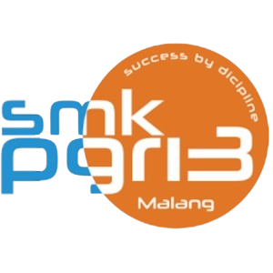

<p align="center">  
  <a href="https://smkpgri3mlg.web.id" target="_blank">  
      
  </a>  
</p>  

<p align="center">  
  <a href="https://laravel.com/"></a>  
  <a href="https://tailwindcss.com/"></a>  
  <a href="https://alpinejs.dev/"></a>  
  <a href="https://swiperjs.com/"></a>  
  <a href="https://www.chartjs.org/"></a>  
  <a href="https://vitejs.dev/"></a>  
  <a href="https://ai.google.dev/gemini"></a>  
  <a href="https://www.typescriptlang.org/"></a>  
  <a href="https://www.php.net/"></a>  
  <a href="#"></a>  
  <a href="#"></a>  
  <a href="#"></a>  
  <a href="https://nodejs.org/"></a>  
  <a href="https://mariadb.org/"></a>  
  <a href="LICENSE"></a>  
</p>  

<h2 align="center">📌 CTRL + V — Membangun Website Sekolah yang Informatif dan Kreatif</h2>  

<p align="center">  
  Presensi kapan saja, di mana saja, dengan verifikasi wajah dan video untuk kehadiran yang lebih autentik.  
</p>  

---

📖 **Tentang Website Ini**

Website ini adalah platform sekolah yang Informatif dan Kreatif untuk menampilkan informasi, berita, dan konten terkait sekolah.  
Didesain untuk memberikan pengalaman pengguna yang menarik dan mudah dinavigasi, serta responsif di semua perangkat.

---

✨ **Fitur Utama**

📸 Side News dan Sidebar dengan konten yang informatif.  
🌐 Akses dari berbagai perangkat yang terhubung internet.  
📊 Data yang selalu diperbarui dan akurat.  
🔒 Keamanan data dengan enkripsi dan kontrol akses.

---

🛠️ **Teknologi yang Digunakan**

**Frontend:**
- Tailwind CSS 3  
- AlpineJS  
- Swiper  
- Chart.js  
- TypeScript  
- HTML5, CSS3, JavaScript (ES6)  
- Vite  

**Backend:**
- Laravel 12  
- PHP 8.2  
- Node.js (untuk build tools)  
- Gemini AI (Integrasi AI)  

**Database:**
- MariaDB  

**Server:**
- Nginx  
- Ubuntu  
- Memcached  

**Assets & Icon:**
- Font Awesome  
- W3S SVG  

**Lisensi:**
- MIT License  

---

🚀 **Instalasi**

```bash
# Clone repository  
git clone https://github.com/NauvalMaulana-Damn/CTRL-V-JHIC.git  
cd CTRL-V-JHIC

# Install dependencies  
composer install
composer upgrade
npm install && npm upgrade

# Setup environment  
php artisan key:generate --ansi

# Konfigurasi database di file .env  
php artisan migrate --seed

# Build frontend  
npm run build && npm run dev

# Jalankan server  
php artisan serve --host=127.0.0.1 --port=8000